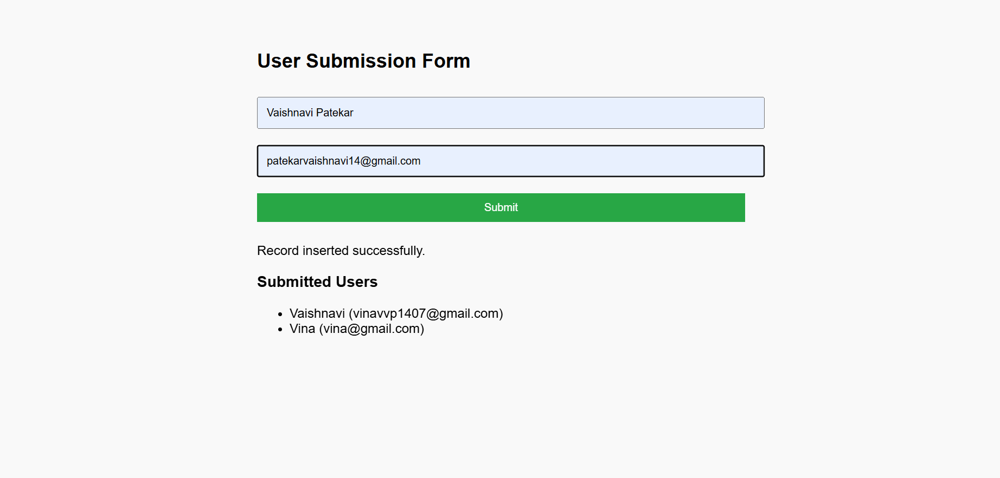

# 👤 User Submission Website (PHP + MySQL)

This is a simple PHP + MySQL-based web application where users can submit their name and email. The data is saved in a MySQL database and displayed below the form.

## 📌 Features

- HTML form to collect name and email
- Data saved to a MySQL `users` table
- List of all submitted users shown on the page
- Basic styling with CSS
- Clean and beginner-friendly PHP code

## 🛠 Technologies Used

- HTML
- CSS
- PHP
- MySQL
- phpMyAdmin (for managing the database)
- XAMPP (for local server)

## 📁 Folder Structure
User Submission/
├── db.php # MySQL connection
├── index.php # Main frontend & backend logic
└── style.css # CSS styling


## ⚙️ Setup Instructions

1. 🔥 Start your XAMPP server:
   - Run **Apache** and **MySQL**

2. 🧠 Create MySQL Database:
   - Go to [http://localhost/phpmyadmin](http://localhost/phpmyadmin)
   - Create a database named: `simple_site`
   - Run the following SQL to create the table:

   ```sql
   CREATE TABLE users (
       id INT AUTO_INCREMENT PRIMARY KEY,
       name VARCHAR(100) NOT NULL,
       email VARCHAR(100) NOT NULL
   );
3. 🧾 File Placement:

Place the User Submission folder in: C:/xampp/htdocs/

4. 🌐 Run in Browser:

Open browser and visit:
http://localhost/User%20Submission

5. ✅ Use:

Fill in the form and submit.

Submitted users will be displayed below.

🧪 Sample Screenshot


